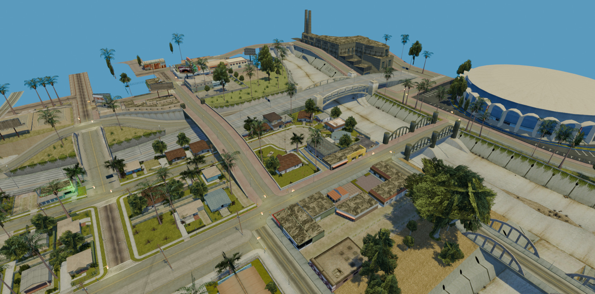
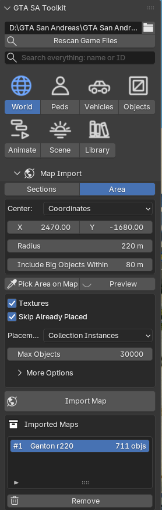
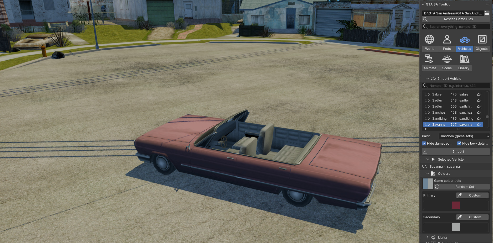
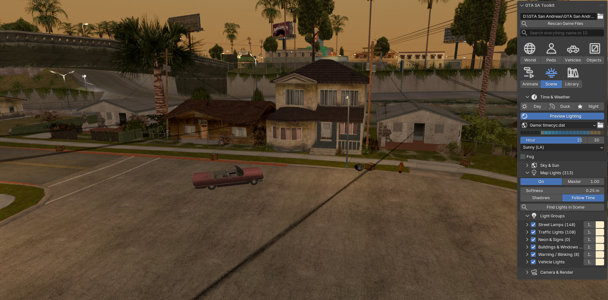

# GTA SA Toolkit

I'm Benji, I've been messing around with SA-MP and GTA San Andreas mods for years. I made this because I wanted SA maps, peds and animations in a modern Blender without juggling five different tools to get there. It started as a bunch of scripts for myself and grew into an add-on, so here it is.

It reads the game's own files (models, textures, maps, animations) right out of your install. You don't
need any other add-on next to it.

*Grove Street and around, imported with the game's daytime sky.*

## What it does

You can pick an area on the game's radar map, see what'll be placed, and import it with textures, lights
and collisions if you want them. Whole map sections work too. If you import over an area you already did,
it skips what's there, and you can take an import out again in one click.

*The World tab, set to import 220 m around Ganton.*

Peds come in standing in their idle pose, by name, ID or type, story characters included. Vehicles get
working wheels, the game's colour sets (or your own colours), lights, paintjobs, doors that open and the
upgrades from carmods. Weapons and any object, SA-MP objects too, by name or ID.

*A Savanna on Grove Street. Its colours are set in the Vehicles tab.*

For animation there's a browser for everything in ped.ifp and anim.img. Apply a clip, chain a few together
with blends in the Animate tab, then bake and export an IFP. Exporting with Replace changes an existing IFP
file, so it asks you first and keeps a .bak copy of the original.

SA-MP stuff:
- paste CreateObject lines to place a map, or export placed objects back to Pawn
- attach toys from a SetPlayerAttachedObject line, move them around, copy the line back

The Studio part does time of day and weather from the game's timecyc (sky, sun, street lights coming on at
night), light groups, a camera and render helper, and the game's traffic and ped paths, with a car or ped
that can drive or walk a route. If you don't need it, turn it off in the add-on's preferences, all of it
or piece by piece.

*CJ's house at 21:30. The sky comes from timecyc and the street lights are on.*

There's also a Fix Missing GTA Textures button for old .blend files where the textures point to a game
folder that isn't there anymore. And you can point it at folders with your own modded models (loose .dff
and .txd files or .img archives).

## Requirements

- **A legal copy of GTA San Andreas for PC.** This add-on contains **no game files**. Everything you see in
  Blender is read from your own install.
- Blender 4.4 or newer.
- SA-MP installed in the game folder if you want its objects and toys.

Tested on Windows. macOS and Linux should work with a copy of the game folder, but I haven't tried.

## Install

1. Grab `gta_sa_toolkit-<version>.zip` from [Releases](https://github.com/LiorKag/GTA-SA-Toolkit/releases)
   (or from Blender's Get Extensions once it's listed there).
2. In Blender go to Edit > Preferences > Get Extensions, open the little arrow menu at the top right and
   pick Install from Disk. Choose the zip.
3. In the 3D View press N, open the GTA tab, pick your GTA San Andreas folder and hit Scan Game Files.

## Known issues and limitations

- Only tested on Windows so far.
- CJ's clothes are only partly there. The clothing files hold three versions each (normal, fat, muscular)
  and only the first one gets imported for now.
- Paintjobs on custom cars may not fit, since they use the paintjob of the game car they're based on.
- If you still have DragonFF turned on, switch off its Real Time Update (or DragonFF itself). It re-scans
  every object after each change and big scenes get really slow. This add-on doesn't need it.

It never connects to the internet. It only writes files where you tell it to (IFP and Pawn exports, the
optional asset cache in a folder you pick) plus its own settings folder in Blender's user data.

Found a bug or something weird? [Open an issue](https://github.com/LiorKag/GTA-SA-Toolkit/issues).

## Credits

- [DragonFF](https://github.com/Parik27/DragonFF) by Parik and contributors (GPL-3.0-or-later), which this
  add-on originally built on. The way models are put together in Blender follows it, and a couple of its
  tables are reused (collision surfaces, material names).
- Collision surface names and colours come from col.ini by Steve-M.
- The [GTAMods wiki](https://gtamods.com/wiki/), for documenting the file formats.

GTA, Grand Theft Auto and San Andreas are trademarks of Take-Two Interactive and Rockstar Games. This
project isn't affiliated with or endorsed by them.

## License

GPL-3.0-or-later, see [LICENSE](LICENSE). The tab icons (`gta_sa_toolkit/icons` and
`gta_sa_toolkit/studio/icons`) are my own line art and are CC0.
